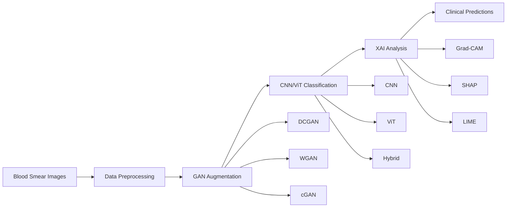

# Enhancing Leukemia Diagnosis with Synthetic Data and Explainable Deep Learning Architectures

[](https://python.org)
[](https://tensorflow.org)
[](LICENSE)

> **AI-powered framework for leukemia diagnosis using microscopic blood smear images, combining Generative Adversarial Networks, Vision Transformers, and Explainable AI for clinical interpretability.**

## Overview

This research addresses critical challenges in leukemia diagnosis by developing a comprehensive AI framework that combines:
- **Generative Adversarial Networks (GANs)** for synthetic data augmentation
- **Vision Transformers (ViTs)** and **CNNs** for classification
- **Explainable AI (XAI)** for clinical interpretability

The system transforms time-intensive, error-prone manual diagnosis into rapid, accurate, and transparent AI-assisted detection suitable for clinical deployment.

## Key Achievements

| Metric               | Improvement                       | Clinical Significance                       |
| -------------------- | --------------------------------- | ------------------------------------------- |
| **Sensitivity**      | **167% increase** (0.187 → 0.500) | Dramatically reduces missed cancer cases    |
| **Accuracy**         | **74%** (ViT-WGAN)                | Best performing architecture combination    |
| **Interpretability** | **3 XAI methods**                 | Transparent predictions for clinician trust |

## Novel Research Contributions

### **Architecture-GAN Discovery**
- **CNNs perform best** with conditional GAN (cGAN) augmentation
- **Vision Transformers excel** with Wasserstein GAN (WGAN) despite lower image quality
- **Challenges conventional wisdom** that higher quality synthetic data always improves performance

### **Comprehensive Explainable AI Framework**
- **Grad-CAM**: Visual attention heatmaps focusing on cell boundaries
- **SHAP**: Global feature importance revealing healthy vs. cancer cell patterns
- **LIME**: Local explanations through superpixel analysis
- **Clinical validation**: Models learn biologically relevant morphological features

### **Rigorous Synthetic Data Validation**
- **Quality metrics**: FID (1.1897), SSIM (0.8869), Inception Score evaluation
- **1,267 synthetic images** generated with clinical morphological accuracy
- **Class imbalance solution**: Addresses 2.12:1 cancer-to-normal ratio in medical datasets

## Clinical Impact

### **Real-World Benefits**
- **Non-invasive**: Replaces painful bone marrow biopsies
- **Rapid diagnosis**: From hours to seconds for initial screening
- **Accessible**: Reduces dependency on specialized hematopathologists
- **Cost-effective**: $2,000+ savings per avoided invasive procedure
- **Scalable**: Deployable in resource-limited healthcare settings

### **Patient Safety**
- **False negative reduction**: Critical for cancer screening where missed cases can be fatal
- **Transparent decisions**: XAI enables clinician verification and trust
- **Standardized analysis**: Consistent results across institutions and operators

## Results Summary

### **Model Performance Comparison**

| Architecture | Dataset  | Accuracy | Sensitivity | Specificity | F1-Score | AUC       |
| ------------ | -------- | -------- | ----------- | ----------- | -------- | --------- |
| CNN          | Original | 70%      | 19.4%       | 96.1%       | 60%      | 0.594     |
| CNN          | cGAN     | **71%**  | **26.7%**   | **96.8%**   | **65%**  | **0.602** |
| ViT          | Original | 70%      | 18.7%       | 96.7%       | 55%      | 0.577     |
| ViT          | WGAN     | **74%**  | **50.0%**   | **86.3%**   | **73%**  | **0.681** |
| Hybrid       | DCGAN    | 68%      | 48.2%       | 77.7%       | 66%      | 0.661     |

### **GAN Quality Assessment**

| Model    | FID ↓      | SSIM ↑     | Best Architecture |
| -------- | ---------- | ---------- | ----------------- |
| **cGAN** | **1.1897** | **0.8869** | CNN               |
| DCGAN    | 1.2745     | 0.8604     | Hybrid            |
| WGAN     | 2.9208     | 0.8685     | **ViT**           |

*Lower FID and higher SSIM indicate better image quality*

## Technical Architecture

### **Multi-Component Framework**



### **Model Specifications**

#### **Generative Models**
- **DCGAN**: 225 epochs, batch_size=32, stable baseline generation
- **WGAN**: Gradient penalty (λ=10), 5 critic iterations, improved diversity
- **cGAN**: Class-conditional generation, highest quality metrics (FID: 1.1897)

#### **Classification Models**
- **CNN**: 3 conv blocks (32→64→128 filters) + dense layers
- **ViT**: 16×16 patches, 4 attention heads, 4 transformer blocks
- **Hybrid**: CNN feature extraction + ViT global context processing

## Quick Start

### **Installation**
```bash
git clone https://github.com/ibrahimssmalik/leukemia-ai.git
cd leukemia-ai
pip install -r requirements.txt
```

### **Dataset Setup**
Due to size constraints, download the C-NMC dataset from:
- **Primary source**: [Cancer Imaging Archive](https://wiki.cancerimagingarchive.net/pages/viewpage.action?pageId=52758223)

Follow the [Configuration Manual](docs/configuration_manual.pdf) for complete setup instructions.

## Repository Contents

### **Core Implementation**
- [`notebooks/`](notebooks/) - Complete experimental Jupyter notebooks
- [`src/`](src/) - Production-ready Python modules
- [`docs/`](docs/) - Research thesis and documentation
- [`results/`](results/) - Experimental results and visualizations

### **Research Documentation**
- [`configuration_manual.pdf`](docs/configuration_manual.pdf) - Reproducibility guide
- [`presentation.pptx`](docs/presentation.pptx) - Research presentation slides

## Research Methodology

### **Dataset**
- **Source**: C-NMC Leukemia Dataset (Cancer Imaging Archive)
- **Size**: 13,000+ pediatric blood smear images
- **Challenge**: 2.12:1 class imbalance (cancer:normal)
- **Preprocessing**: 224×224 RGB, normalized [0,1]

### **Experimental Design**
- **3 GAN variants**: DCGAN, WGAN-GP, conditional GAN
- **4 classification approaches**: CNN, ViT, CNN-ViT hybrid, baseline
- **3 XAI methods**: Grad-CAM, SHAP, LIME
- **Validation**: 3-fold cross-validation + separate test set

### **Evaluation Metrics**
- **Classification**: Accuracy, Precision, Recall, F1-Score, AUC, Sensitivity, Specificity
- **GAN Quality**: Fréchet Inception Distance (FID), Structural Similarity Index (SSIM), Inception Score
- **Clinical Relevance**: Sensitivity prioritization for cancer screening applications

## Academic Context

### **Research Question**
*"To what extent can the combination of Generative Adversarial Networks, Vision Transformers, and Explainable AI improve the accuracy and interpretability of leukemia classification on microscopic blood smear images?"*

## Future Work

### **Immediate Enhancements**
- Multi-class leukemia subtype classification (ALL, AML, CML, CLL)
- Cross-dataset validation (BCCD, LISC databases)
- Uncertainty quantification through Bayesian approaches

### **Clinical Translation**
- Prospective clinical trials and validation studies
- Integration with hospital PACS/LIS systems
- FDA regulatory approval pathway
- Real-world deployment optimization

### **Technical Advances**
- Foundation model integration (CLIP, SAM)
- Federated learning for privacy-preserving training
- Edge deployment for point-of-care applications

## Citation

If you use this work in your research, please cite:

```bibtex
@mastersthesis{malik2025leukemia,
  title={Enhancing Leukemia Diagnosis with Synthetic Data and Explainable Deep Learning Architectures},
  author={Malik, Ibrahim},
  year={2025},
  school={National College of Ireland},
  type={MSc Thesis},
  program={Data Analytics}
}
```

## License

This project is licensed under the MIT License - see the [LICENSE](LICENSE) file for details.

---

*Built with ❤️ for advancing AI in healthcare*